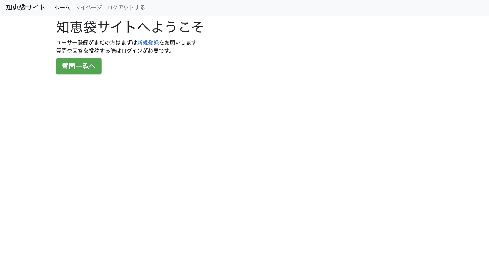
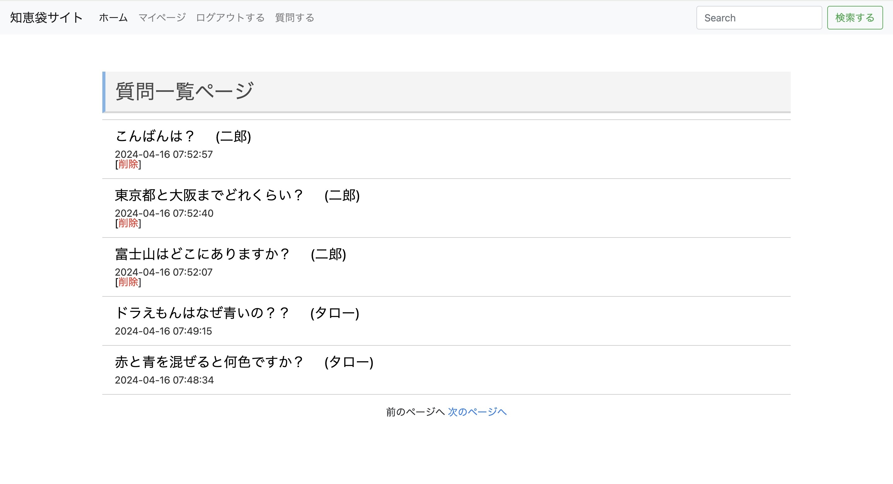
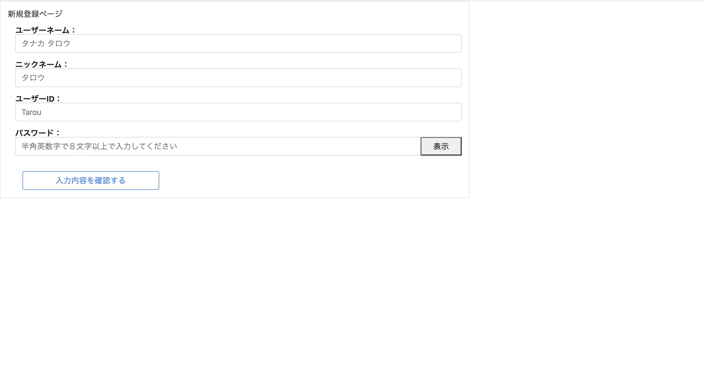
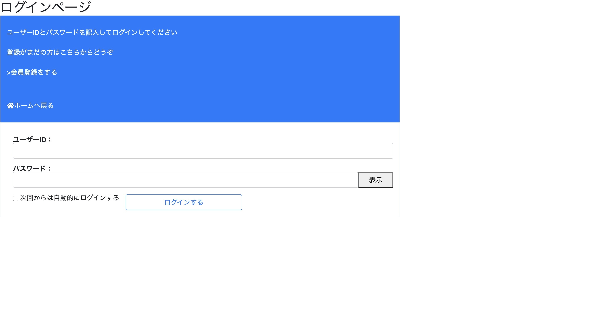
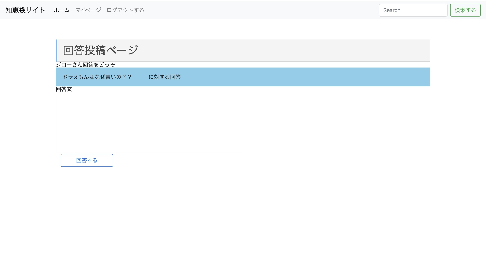
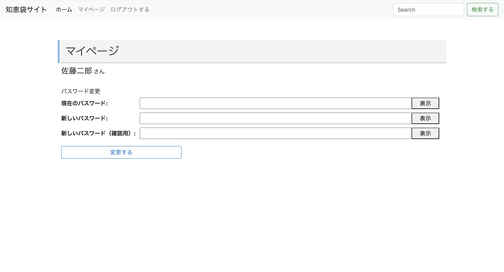
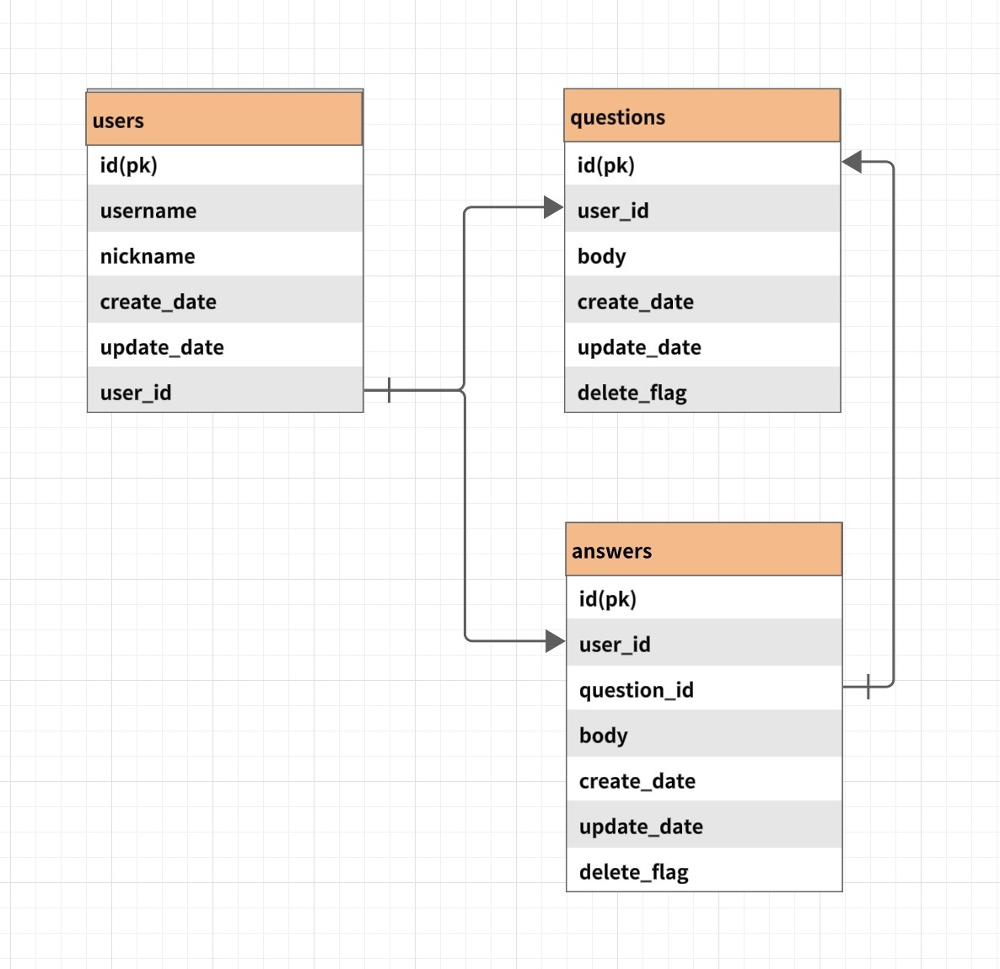

# Yahoo知恵袋風の掲示板サイト

 これはPHPで作成されたWebアプリケーションです。質問と回答を投稿し、ユーザー間で疑問や回答を投稿できます。

# 主なページと機能 

|　TOPページ  | 質問一覧ページ |
| ---- | ---- |
| | |
| topページです。 | 質問一覧ページです。ユーザーはログインしていなくても質問や回答を見ることができます。 |

| ユーザ登録ページ | ログインページ |
| ---- | ---- |
| | |
| ゲストはユーザー登録することで質問や回答を投稿することができます。ユーザーIDは他のユーザーと被ることはありません | ユーザーは登録ページで登録したユーザーIDとパスワードを入力することでログインすることができます。ヘッダーのログアウトボタンでログアウトすることができます |

| 質問投稿ページ |　回答投稿ページ |
| ---- | ---- |
| | |
| ユーザーはログインすることで質問を投稿できます。投稿した質問は削除することができます。 | ユーザーはログインすることで回答を投稿できます。 |

| マイページ |　回答投稿ページ |
| ---- | ---- |
| | |
| ログインしているユーザーはマイページで自分の情報を編集することができます。右側の歯車マークから編集できます | 歯車ボタンを押してパスワードを編集をクリックするとパスワードを編集できます |

# 使用している技術
* PHP
* Bootstrap
* HTML&CSS
* MySQL
* docker

# ER図

# 環境構築
このwebアプリはdockerを使用します。dockerがインストールされてることを確認してください。

①GitHubからリポジトリをクローンする
git clone  https://github.com/uheiji/php-kadai.git

②Dockerコンテナを起動します
docker-compose up 

③ブラウザで http://localhost:8000 にアクセスしてアプリケーションを利用できます

# 作成者 

* uheiji

